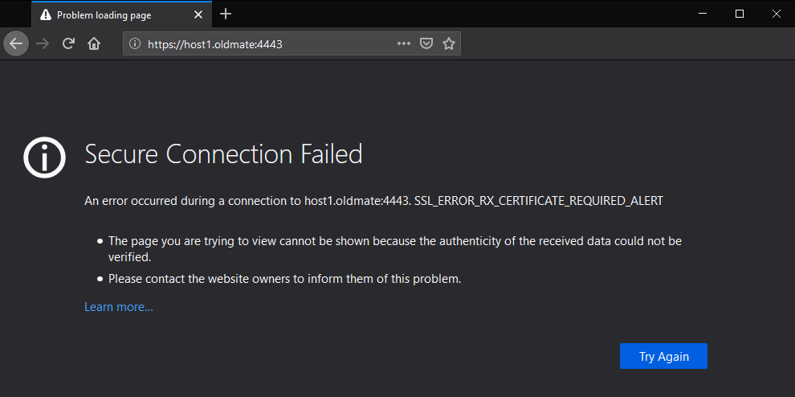
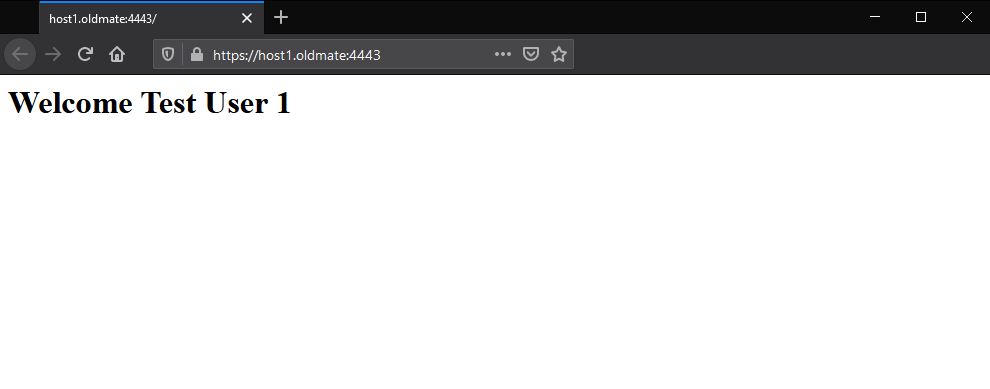

# Certificate Based Mutual Authentication

Example of how to setup Cert-Based Mutual Authentication for a NodeJS web server using the express framework. The user certificates that are presented will obliviously have to be signed by the same CA that is loaded below in the `serverOptions` object:

```javascript
const express = require('express');
const path = require('path');
const fs = require('fs');
const app = express();

const HOSTNAME = 'host1.oldmate';
const PORT = 4443;

const serverOptions = {
	hostname: HOSTNAME,
	port: PORT,

	// Certificates
	ca: fs.readFileSync(path.join(__dirname, 'certs/ca.crt')),
	cert: fs.readFileSync(path.join(__dirname, 'certs/host1.crt')),
	key: fs.readFileSync(path.join(__dirname, 'certs/host1.key')),

	// Cert-Based Mutual Auth settings
	requestCert: true,
	rejectUnauthorized: true,

	// TLS Settings
	minVersion: 'TLSv1.3',
	maxVersion: 'TLSv1.3',

	// Optional: For hardened configuration
	echdCurve: 'secp384r1',
	ciphers: 'TLS_AES_256_GCM_SHA384:TLS_AES_128_GCM_SHA256',
	sigalgs: 'ecdsa_secp384r1_sha384',

	// Attempt to user Server cipher suite preference instead of clients.
	honorCipherOrder: true
}

const server = require('https').Server(serverOptions, app);

// Handle decode error incase an invalid URI is sent.
app.use((req, res, next) => {
	try {
		decodeURIComponent(req.path)
		next();
	} catch (err) {
		res.sendStatus(404);
	}
});

// Handle Cert-Based Mutual Auth
// This isn't required if `rejectUnauthorized` is `true`. This can be used to if you want a custom handler when the certificate is presented.
app.use((req, res, next) => {
	try {
		const cert = req.socket.getPeerCertificate();

		if (req.client.authorized) {
			// res.send(`Your certificate ${cert.subject.CN} was issued by ${cert.issuer.CN}`);
			next();
		} else if (cert.subject) {
			// res.send(`Certificates from ${cert.issuer.CN} are not valid. User ${cert.subject.CN},`);
			res.status(403).send(`Not Authorised`);
		} else {
			// res.send(`Certificate Required`);
			res.status(403).send(`Not Authorised`);
		}
	} catch (err) {
		res.sendStatus(404);
	}
});

app.get('/', (req, res) => {
	// Get the certificate associated with this request
	const cert = req.socket.getPeerCertificate() || { subject: {} };

	// Clean the username before adding it to the HTML
	const username = cert.subject.CN.match(/[a-zA-Z0-9\s]*/g).join('');

	res.send(`<h1>Welcome ${username}</h1>`);
});

// Catch any unforeseen errors
app.use((err, __, res, ___) => res.send({ success: false }));

// Start the Server
server.listen(PORT, () => {
    console.log(`[-] Server Listening on Port ${PORT}`);
});
```

<br>

# Without a Certificate:




<br>

# With a valid Certificate:


