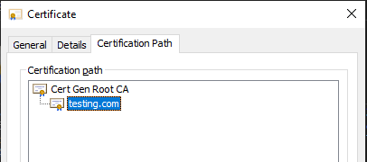
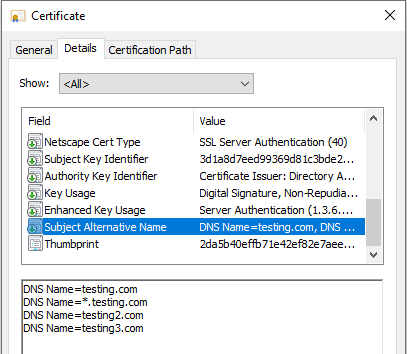
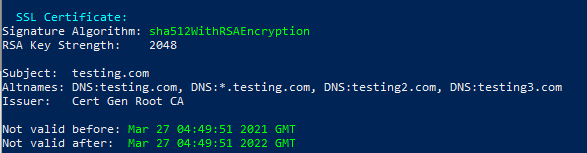
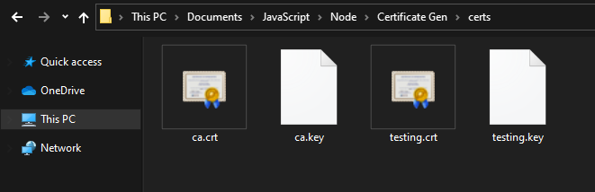

# Certificate Generation (Pure JS with node-forge)

Creating a Certificate Authority (CA) and signing Host Certificates using only the `node-forge` npm package without OpenSSL:

```javascript
const forge = require('node-forge');
const path = require('path');
const fs = require('fs');

const makeNumberPositive = (hexString) => {
	let mostSiginficativeHexDigitAsInt = parseInt(hexString[0], 16);

	if (mostSiginficativeHexDigitAsInt < 8) return hexString;

	mostSiginficativeHexDigitAsInt -= 8
	return mostSiginficativeHexDigitAsInt.toString() + hexString.substring(1)
}

const randomSerialNumber = () => {
	return makeNumberPositive(forge.util.bytesToHex(forge.random.getBytesSync(20)));
}

const createCA = (name="ca") => {
	// Create a new Keypair for the CA
	const keypair = forge.pki.rsa.generateKeyPair(2048);

	// Define the attributes for the new CA
	const attributes = [{
		shortName: 'C',
		value: 'AU'
	}, {
		shortName: 'ST',
		value: 'Victoria'
	}, {
		shortName: 'L',
		value: 'Melbourne'
	}, {
		shortName: 'CN',
		value: 'Cert Gen Root CA'
	}];

	const extensions = [{
		name: 'basicConstraints',
		cA: true
	}, {
		name: 'keyUsage',
		keyCertSign: true,
		cRLSign: true
	}];

	// Create an empty Certificate
	const cert = forge.pki.createCertificate();

	// Set the CA attributes in the new Certificate
	cert.publicKey = keypair.publicKey;
	cert.privateKey = keypair.privateKey;
	cert.serialNumber = randomSerialNumber();
	cert.validity.notBefore = new Date();
	cert.validity.notAfter = new Date();
	cert.validity.notAfter.setYear(cert.validity.notBefore.getFullYear() + 100);
	cert.setSubject(attributes);
	cert.setIssuer(attributes);
	cert.setExtensions(extensions);

	// Self-sign the Certificate
	cert.sign(keypair.privateKey, forge.md.sha512.create());

	// Convert to PEM format
	const pemCert = forge.pki.certificateToPem(cert);
	const pemKey = forge.pki.privateKeyToPem(keypair.privateKey);

	// Write the Certificate and Key to disk
	fs.writeFileSync(path.join(__dirname, `certs/${name}.crt`), pemCert);
	fs.writeFileSync(path.join(__dirname, `certs/${name}.key`), pemKey);

	return { cert: cert, privateKey: keypair.privateKey };
}

const loadCA = (caCertFile, caPrivateKeyFile) => {
	let caCert = fs.readFileSync(caCertFile).toString('utf-8');
	let caKey = fs.readFileSync(caPrivateKeyFile).toString('utf-8');

	caCert = forge.pki.certificateFromPem(caCert);
	caKey = forge.pki.privateKeyFromPem(caKey);

	return { cert: caCert, privateKey: caKey };
}

/*
name: String => The name of the Certificate.
domainNames: Array of Strings => List of domains the Certificate is valid for.
CA: Object => Object containing the public and private key of the CA that will sign the Certificate.
outputName: String => The name of the output files. "outputName.crt" & "outputName.key".
*/
const createCert = (name, domainNames, CA, outputName) => {
	if (!name.toString().trim()) throw new Error('"name" must be a String');
	if (!Array.isArray(domainNames)) throw new Error('"domainNames" must be an Array of Strings');
	if (!CA || !CA.hasOwnProperty('cert') || !CA.hasOwnProperty('privateKey')) throw new Error('"CA" must be an Object with the properties "cert" & "privateKey"');
	if (!outputName.toString().trim()) throw new Error('"outputName" must be a String');

	// Create a new Keypair for the Host Certificate
	const hostKeys = forge.pki.rsa.generateKeyPair(2048);

	// Define the attributes/properties for the Host Certificate
	const attributes = [{
		shortName: 'C',
		value: 'AU'
	}, {
		shortName: 'ST',
		value: 'Victoria'
	}, {
		shortName: 'L',
		value: 'Melbourne'
	}, {
		shortName: 'O',
		value: 'whatever'
	}, {
		shortName: 'OU',
		value: 'whatever'
	}, {
		shortName: 'CN',
		value: name
	}];
	
	const extensions = [{
		name: 'basicConstraints',
		cA: false
	}, {
		name: 'nsCertType',
		server: true
	}, {
		name: 'subjectKeyIdentifier'
	}, {
		name: 'authorityKeyIdentifier',
		authorityCertIssuer: true,
		serialNumber: CA.cert.serialNumber
	}, {
		name: 'keyUsage',
		digitalSignature: true,
		nonRepudiation: true,
		keyEncipherment: true
	}, {
		name: 'extKeyUsage',
		serverAuth: true
	}, {
		name: 'subjectAltName',
		altNames: domainNames.map(domainNames => {return { type: 2, value: domainNames }})
	}];

	// Create an empty Certificate
	const cert = forge.pki.createCertificate();

	// Set the CA attributes in the Host Certificate
	cert.publicKey = hostKeys.publicKey;
	cert.serialNumber = randomSerialNumber();
	cert.validity.notBefore = new Date();
	cert.validity.notAfter = new Date();
	cert.validity.notAfter.setYear(cert.validity.notAfter.getFullYear() + 1);
	cert.setSubject(attributes);
	cert.setIssuer(CA.cert.subject.attributes);
	cert.setExtensions(extensions);

	// Sign the new Host Certificate using the CA
	cert.sign(CA.privateKey, forge.md.sha512.create());

	// Convert to PEM format
	const pemHostCert = forge.pki.certificateToPem(cert);
	const pemHostKey = forge.pki.privateKeyToPem(hostKeys.privateKey);

	// Write the Certificate and Key to disk
	fs.writeFileSync(path.join(__dirname, `certs/${outputName}.crt`), pemHostCert);
	fs.writeFileSync(path.join(__dirname, `certs/${outputName}.key`), pemHostKey);
}
```

<br>

## Create a new CA
```javascript
// Create a new CA
const CA = createCA();
```

<br>

## Load CA and Generate Host Certificate
```javascript
// Load an Existing CA
let caCert = path.join(__dirname, 'certs/ca.crt');
let caKey = path.join(__dirname, 'certs/ca.key');
let CA = loadCA(caCert, caKey);

// Generate Host Certificate
createCert('testing.com', ['testing.com', '*.testing.com', 'testing2.com', 'testing3.com'], CA, 'testing');
```

<br>

## `createCert` Function Breakdown

First Parameter `testing.com` is the Common Name (CN) of the Certificate:



<hr>

Second Parameter `['testing.com', '*.testing.com', 'testing2.com', 'testing3.com']` is the `Subject Alternative Name`for the Certificate. The Certificate will be valid for all of these domains:




 - Using the wildcard entry `*.testing.com` does NOT include `testing.com`, it must be included as a separate entry.  
 - The `Subject` field in the above image is the Common Name (CN) of the Certificate.

<hr>

Third Parameter is the Object returned by the `LoadCA` or `CreateCA` function. Both of theses functions return an Object containing the Cert and Key of the CA.

<hr>

Fourth Parameter is the name of the output files `testing.crt` & `testing.key`:



<hr>

