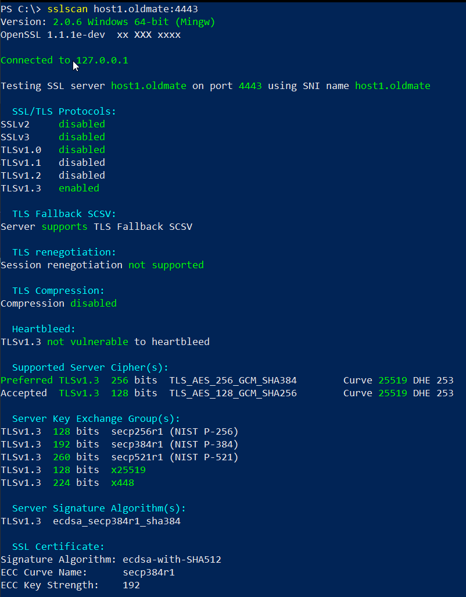
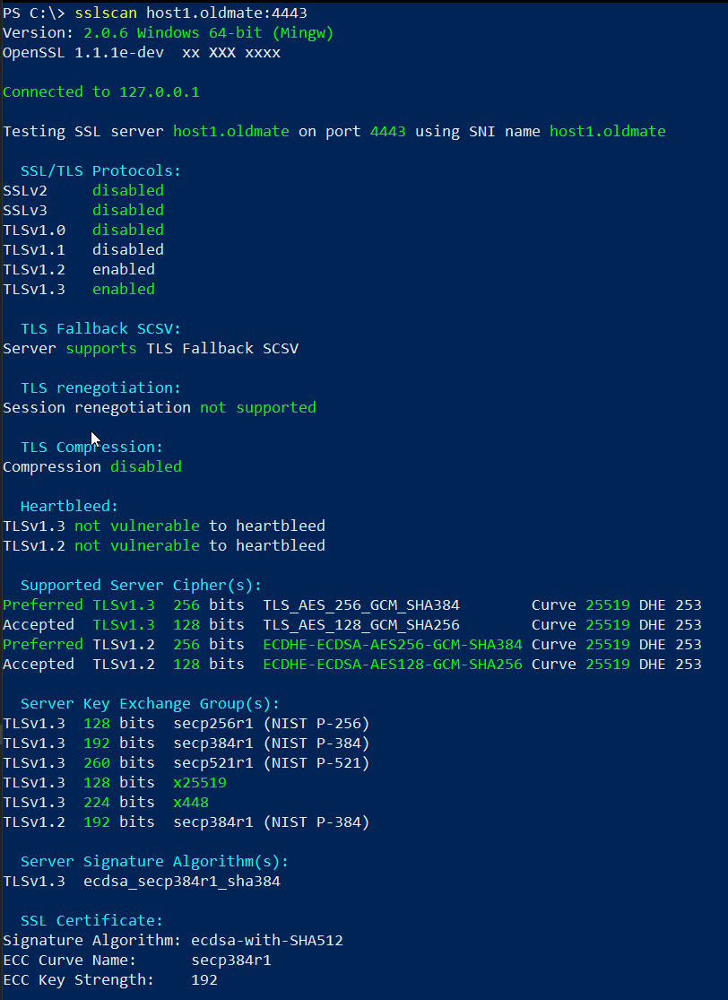

# HTTPS Server

Setting up a HTTPS server in the express framework:


```javascript
const fs = require('fs');
const path = require('path');
const express = require('express');
const bodyParser = require('body-parser');
const helmet = require('helmet');

const app = express();

const HOSTNAME = 'host1.oldmate';
const PORT = 4443;

const serverOptions = {
	hostname: HOSTNAME,
	port: PORT,

	// Certificates
	ca: fs.readFileSync(path.join(__dirname, 'certs/ca.crt')),
	cert: fs.readFileSync(path.join(__dirname, 'certs/host1.crt')),
	key: fs.readFileSync(path.join(__dirname, 'certs/host1.key')),

	// TLS Version
	maxVersion: 'TLSv1.3',
	minVersion: 'TLSv1.3',

	// Optional: For hardened configuration
	echdCurve: 'secp384r1',
	ciphers: 'TLS_AES_256_GCM_SHA384:TLS_AES_128_GCM_SHA256',
	sigalgs: 'ecdsa_secp384r1_sha384',

	// Attempt to user Server cipher suite preference instead of clients.
	honorCipherOrder: true
}

const server = require('https').Server(serverOptions, app);

// Support JSON encoded POST request bodies
app.use(bodyParser.json());

// Harden the Server
app.use(helmet.noSniff());
app.use(helmet.frameguard({ action: 'deny' }));
app.use(helmet.referrerPolicy({ policy: 'no-referrer' }));
app.use(helmet.contentSecurityPolicy({
	directives: {
		defaultSrc: [`'self'`]
	}
}));
app.use(helmet.hsts({   
	maxAge: 31536000,
	includeSubDomains: true,
	preload: true
}));

// Handle decode error in-case an invalid URI is sent.
app.use((req, res, next) => {
	try {
		decodeURIComponent(req.path)
		next();
	} catch (err) {
		res.sendStatus(404);
	}
});

// Return the home page file
app.get('/', (req, res) => {
	res.sendFile(path.join(__dirname, 'index.html'));
});

// Catch any unforeseen errors
app.use((err, __, res, ___) => res.send({ success: false }));

// Start the Web-Server
server.listen(PORT, () => {
	console.log(`[+] Server Started Listening on Port ${PORT}`);
});
```

<br>

# SSL Scan Results 1:




<br>

# Alternate Settings for TLSv1.2

```javascript
const serverOptions = {
	// TLS Version
	maxVersion: 'TLSv1.3',
	minVersion: 'TLSv1.2',

	// Optional: For hardened configuration
	echdCurve: 'secp384r1',
	ciphers: 'TLS_AES_256_GCM_SHA384:TLS_AES_128_GCM_SHA256:ECDHE-ECDSA-AES256-GCM-SHA384:ECDHE-ECDSA-AES128-GCM-SHA256',
	sigalgs: 'ecdsa_secp384r1_sha384',
}
```

<br>

# SSL Scan Results 2:

