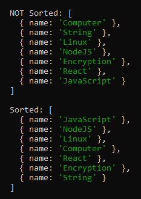

# Sorting List of Objects

### Sort a list of Objects by a Certain Key
```javascript
// Sort a list of Objects by a certain key.
function sortListByKey(list, keyToSortBy, reverse=false) {
	if (reverse) {
		// Sort the list in reverse order (Highest to Lowest)
		list.sort((a,b) => {
			if (a[keyToSortBy] > b[keyToSortBy]) return -1;
			else if (a[keyToSortBy] < b[keyToSortBy]) return 1;
			return 0;
		});
	} else {
		// Sort the list in normal order (Lowest to Highest)
		list.sort((a,b) => {
			if (a[keyToSortBy] > b[keyToSortBy]) return 1;
			else if (a[keyToSortBy] < b[keyToSortBy]) return -1;
			return 0;
		});
	}
}
```

### Sort a list of Objects by a Certain Key Where the Order is Defined
```javascript
const ORDER_BY = [
	'JavaScript',
	'NodeJS',
	'Linux',
	'Computer',
	'React',
];

function sortByKeyAndOrder(list, keyToSortBy) {
	const listOrder = {};
	const maxIndex = list.length + ORDER_BY.length;

	ORDER_BY.forEach((item, index) => { listOrder[item] = index });

	let index1 = -1;
	let index2 = -1;

	list.sort((a,b) => {
		index1 = listOrder.hasOwnProperty(a[keyToSortBy]) ? listOrder[a[keyToSortBy]] : maxIndex;
		index2 = listOrder.hasOwnProperty(b[keyToSortBy]) ? listOrder[b[keyToSortBy]] : maxIndex;

		if (index1 < index2) return -1;
		else if (index1 > index2) return 1;
		return 0;
	});
}

// Sort a list of Objects by a certain key.
function sortListByKey(list, keyToSortBy, reverse=false) {
	if (reverse) {
		// Sort the list in reverse order (Highest to Lowest)
		list.sort((a,b) => {
			if (a[keyToSortBy] > b[keyToSortBy]) return -1;
			else if (a[keyToSortBy] < b[keyToSortBy]) return 1;
			return 0;
		});
	} else {
		// Sort the list in normal order (Lowest to Highest)
		list.sort((a,b) => {
			if (a[keyToSortBy] > b[keyToSortBy]) return 1;
			else if (a[keyToSortBy] < b[keyToSortBy]) return -1;
			return 0;
		});
	}
}


let myList = [
	{ name: 'Computer' },
	{ name: 'String' },
	{ name: 'Linux' },
	{ name: 'NodeJS' },
	{ name: 'Encryption' },
	{ name: 'React' },
	{ name: 'JavaScript' },
]

console.log('\nNOT Sorted:', myList);

sortListByKey(myList, 'name');
sortByKeyAndOrder(myList, 'name');

console.log('\nSorted:', myList);
```

##### Example

