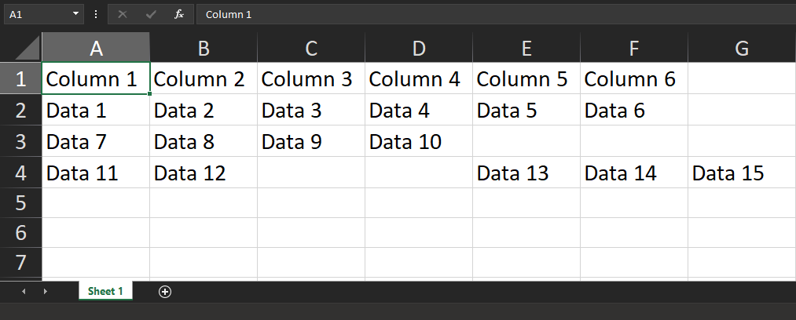

# JavaScript XLSX Module

### Create & Export XLSX Document
```javascript
// import XLSX from 'xlsx'; // Use this for React
const XLSX = require('xlsx');

// Create a new blank XLSX Document
let workbook = XLSX.utils.book_new();

// The data that will be added to the sheet.
let dataForSheet = [
	['Column 1', 'Column 2','Column 3','Column 4','Column 5','Column 6'],
	['Data 1', 'Data 2','Data 3','Data 4','Data 5','Data 6'],
	['Data 7', 'Data 8','Data 9','Data 10'],
	['Data 11', 'Data 12','','','Data 13','Data 14','Data 15'],
];

// Convert the Array data to a sheet.
let sheetData = XLSX.utils.aoa_to_sheet(dataForSheet);

// Add the sheet to the workbook
XLSX.utils.book_append_sheet(workbook, sheetData, 'Sheet 1');

// Save the XLSX File.
XLSX.writeFile(workbook, 'FILE_NAME.xlsx');
```

