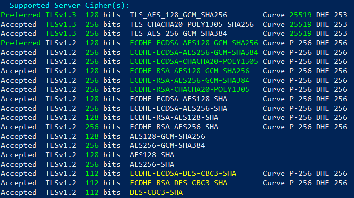
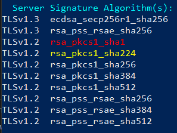

# Test a Specific TLS/SSL Cipher

## Testing TLSv1.3 Cipher

```bash
openssl s_client -connect HOST:PORT -ciphersuites CIPHER_NAME
```

## Testing <= TLSv1.2 Cipher
```bash
openssl s_client -connect HOST:PORT -cipher CIPHER_NAME
```


## Example:



## Testing TLSv1.3 Cipher
```bash
openssl s_client -connect host1.oldmate:4443 -ciphersuites TLS_AES_256_GCM_SHA384
```

## Testing <= TLSv1.2 Cipher
```bash
openssl s_client -connect host1.oldmate:4443 -cipher ECDHE-ECDSA-AES128-GCM-SHA256
```

<br>

# Testing a Specific Signature Algorithm



Note that `SHA256` in the below commands can be substituted for another hash function:
 - SHA1
 - SHA224
 - SHA256
 - SHA384
 - SHA512

## RSA
```bash
openssl s_client -connect HOST:PORT -sigalgs "RSA+SHA256"
```

## DSA
```bash
openssl s_client -connect HOST:PORT -sigalgs "DSA+SHA256"
```

## Elliptic Curve
```bash
openssl s_client -connect HOST:PORT -sigalgs "ECDSA+SHA256"
```