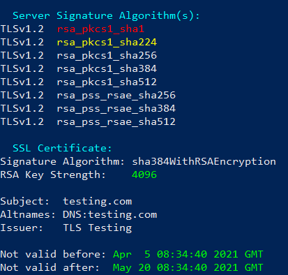
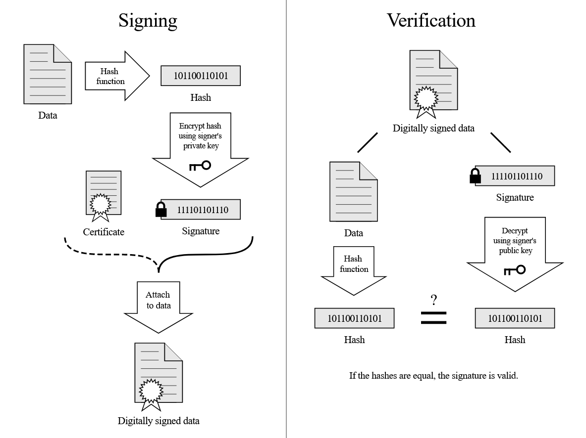
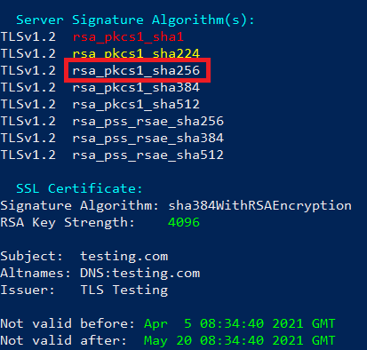
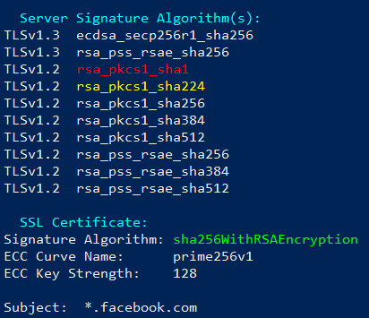
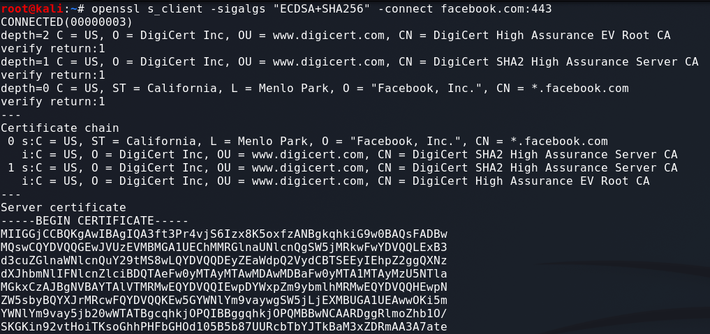
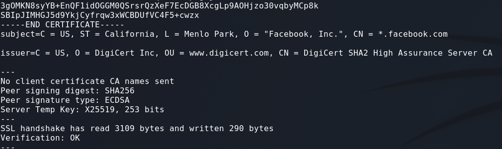
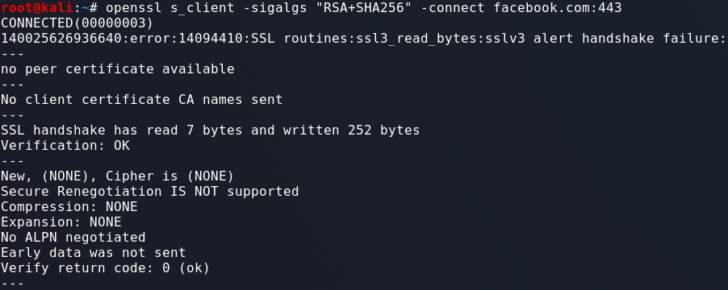
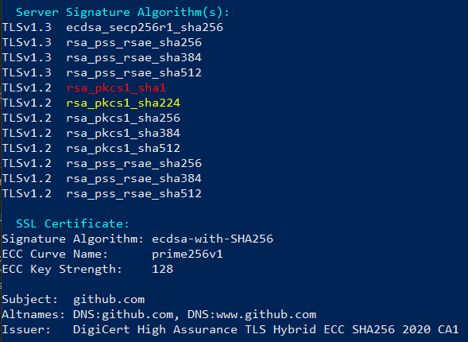

# SSL Scan Results - Server Signature Algorithms:

 - Below we have the `Server Signature Algorithms` and `SSL Certificate` sections from a SSLScan of a web server:

    

### Preface - SSL Certificate

 - The `Signature Algorithm: sha384WithRSAEncryption` line of the `SSL Certificate` section indicates that the Private Key used to sign this Host Certificate is an `RSA key`, and the hash function used the integrity check is `SHA384`. This line DOES NOT tell us anything about the Host Certificate, only what was used to sign it.

 - The following line `RSA Key Strength: 4096` tells us what type of algorithm was used to create the Host Certificate Keys. In this case it was `RSA` with a `4096-bit` key. This is important because we now know that the Private Key for this Host Certificate is an `RSA` key, rather than an `ECC` key.

<br>


### What are Server Signature Algorithms used for?

 - When using TLS, messages sent by the client and server are encrypted using symmetric keys. To do this the client and server both need to be able to calculate the same symmetric keys. This is achieved by exchanging Public keys during the TLS connection setup. These Public keys are not the same as the Host Certificate Public key, these keys are ephemeral (temporary) and are randomly generated at the start of each new connection.

 - During the connection setup phase, the server must generate a Public/Private key pair and send the Public key to the client. However, since this Public key has just been generated, it's not safe to sent to the client as it. This is because the client has no proof that the key was generated by the server. To solve this issue the server signs this new ephemeral Public key using the Private key of the Host Certificate.

 - Below is a diagram of how the signing and verification works. The ephemeral Public key as well as some other information sent during the TLS connection setup is the input data for the Hash Function. The resulting hash is then encrypted using the Private key of the Host Certificate. The ephemeral Public key and the signature are then sent to the client. The client can verify that that Public key is receives is from the server by checking the signature. The signature verification can be done using the Host Certificate Public key.



 - We can now ready to understand the `Server Signature Algorithms` section of the SSLScan. The algorithms listed in this section are the algorithms that the server supports for signing and the ephemeral Public Key in the process that was explained above.

### Server Signature Algorithm Example
  - Below we have the same scan results as above just with one of the algorithms highlighted. Let's break down what the highlight algorithm means.



 - `rsa_pkcs1_sha256` means that the ephemeral Public key will be encrypted using `RSA`. `PKCS1` indicts the standard that is being used. `SHA256` is the hashing algorithm that is used for the integrity check of the data.

 - Notice that all of the `Server Signature Algorithms` have something in common. They all use `RSA`. So why are they all `RSA` and not `ECDSA` or `DSA`?

 - Remember earlier we saw the Host Certificate uses `RSA` by observing the `SSL Certificate` section of the scan. This means the Host Private key is an `RSA` key. Therefore, when we encrypt something using the Host Private key, it must use `RSA` encryption.

 - To think about it another way, let's imagine that one of the algorithms listed in the `Server Signature Algorithms` section said it uses `ECDSA` instead of `RSA`. This would imply that the ephemeral Public key sent during the TLS setup was signed using an `ECC` key. This is not possible because the Host Private key is an `RSA` key not an `ECC` key.

<br>

# Edge Cases

## SSLScan False Positives
 - Unfortunately SSLScan is not perfect, and sometimes we get incorrect results. Let's look at how to identify these and found out the correct results.

 - Have a look at the SSLScan results of `facebook.com` below. See if you can identify what is wrong:

    

 - From the `SSL Certificate` section we can see that this Host Certificate is an `ECC` Cert. Because of this, and what we learnt about what the Signature Algorithms are for, it doesn't make sense for there to be `RSA` algorithms under the `Server Signature Algorithms` section.

 - If this happens then there has most likely been an error with SSLScan. Luckily we can verify the results using `openssl`. Let's see how to do that now.

<br>

### Verifying False Positives

 - Using `openssl` we can connect to a target and specify the Signature Algorithm we wish to use. Here are the commands for doing that:

 - For `dsa_sha***`:
    ```bash
    openssl s_client -sigalgs "DSA+SHA***" -connect TARGET:PORT
    ```

 - For `rsa_pkcs1_sha***`:
    ```bash
    openssl s_client -sigalgs "RSA+SHA***" -connect TARGET:PORT
    ```

 - For `rsa_pss_sha***`:
    ```bash
    openssl s_client -sigalgs "RSA-PSS+SHA***" -connect TARGET:PORT
    ```

 - For `ecdsa_***_sha***`:
    ```bash
    openssl s_client -sigalgs "ECDSA+SHA***" -connect TARGET:PORT
    ```

 - The `*`'s above mean fill in the blank for the algorithm you choose.

<br>

### Verifying False Positive Example
 - Let's go back to our scan of `facebook.com` and see what's wrong. Because we can see that the Host Certificate is an `ECC` Certificate, let's start by verify the `ECDSA` Signature Algorithm:

     

 - The output is quite large so much of the response has been cropped out. From the above output we can see that the connection was successful and the server has sent us back the Host Certificate.

     

 - At the end of the Certificate we can see the information about the Server Signature. The `Peer signing digest:` is set to `SHA256`, which is the hash function we specified. The `Peer signature type:` is set to `ECDSA` which is also what we specified. For some bonus info, the `Server Temp Key` line shows information about the ephemeral (temporary) Public key that the server sent to the client.


 - Let's now try a Signature Algorithm that we think shouldn't work. Let's go with `rsa_pkcs1_sha256`:

      

 - Notice this time we see that no Host Certificate was sent back at all. This indicates that the server doesn't actually support `RSA` Signature Algorithms, which is correct because the Private key is `ECC` not `RSA`.


<br>

# Another Edge Case
 - There is another edge case that can come up sometimes. Let's have a look what happens when we do an SSLScan of `github.com`:

      

 - This seems to be the same case as we had above. Let's see what happens when we try and use both algorithms: