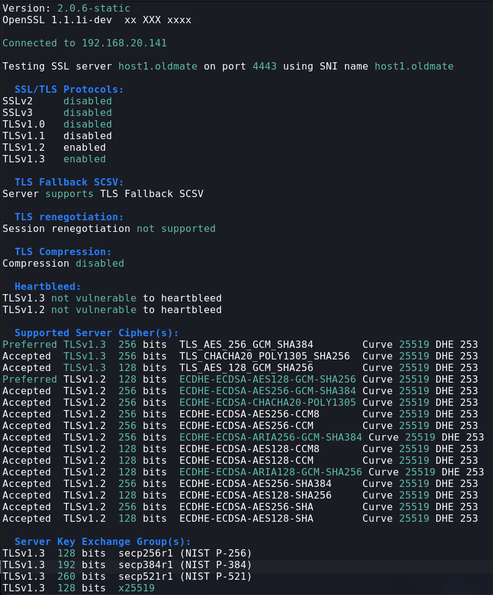

# Test an Specific TLS/SSL Cipher of a Site

### Test a TLSv1.3 Cipher

```bash
openssl s_client -connect HOST:PORT -ciphersuites CIPHER_NAME
```

### Test a <= TLSv1.2 Cipher
```bash
openssl s_client -connect host:port -cipher CIPHER_NAME
```


## Example



### Testing TLSv1.3 Cipher
```bash
openssl s_client -connect host1.oldmate:4443 -ciphersuites TLS_AES_256_GCM_SHA384
```

### Testing TLSv1.2 Cipher
```bash
openssl s_client -connect host1.oldmate:4443 -cipher ECDHE-ECDSA-AES128-GCM-SHA256
```