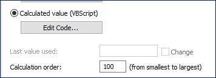

# Basic VBScript for M-Files

## Loading & Returning Values
```vba
Dim a
Dim b
Dim c
Dim result
Dim currencyType

' Loading values from M-Files
a = cDbl (Vault.ObjectPropertyOperations.GetProperty(ObjVer, vault.PropertyDefOperations.GetPropertyDefIDByAlias ("A")).TypedValue.DisplayValue)
b = cDbl (Vault.ObjectPropertyOperations.GetProperty(ObjVer, vault.PropertyDefOperations.GetPropertyDefIDByAlias ("B")).TypedValue.DisplayValue)
c = cDbl (Vault.ObjectPropertyOperations.GetProperty(ObjVer, vault.PropertyDefOperations.GetPropertyDefIDByAlias ("C")).TypedValue.DisplayValue)
currencyType = Vault.ObjectPropertyOperations.GetProperty(ObjVer, vault.PropertyDefOperations.GetPropertyDefIDByAlias ("currentType")).TypedValue.DisplayValue

result = (a*b) / c

' Concatenate multiple things together by using the Ampersand (&) symbol
Output = "$" & Round(result, 4) & " " & currencyType
```

<br>

## If Statements
```vba
Dim a
Dim b
Dim c
Dim result
Dim currencyType

a = cDbl (Vault.ObjectPropertyOperations.GetProperty(ObjVer, vault.PropertyDefOperations.GetPropertyDefIDByAlias ("A")).TypedValue.DisplayValue)
b = cDbl (Vault.ObjectPropertyOperations.GetProperty(ObjVer, vault.PropertyDefOperations.GetPropertyDefIDByAlias ("B")).TypedValue.DisplayValue)
c = cDbl (Vault.ObjectPropertyOperations.GetProperty(ObjVer, vault.PropertyDefOperations.GetPropertyDefIDByAlias ("C")).TypedValue.DisplayValue)
currencyType = Vault.ObjectPropertyOperations.GetProperty(ObjVer, vault.PropertyDefOperations.GetPropertyDefIDByAlias ("testCurrency")).TypedValue.DisplayValue

result = (a*b) / c

If (InStr(currencyType, "Australian Dollars")) Then
  Output = "$" & Round(result, 4)
ElseIf (InStr(currencyType, "Euros")) Then
  Output = "€" & Round(result, 4)
ElseIf (InStr(currencyType, "Pounds")) Then
  Output = "£" & Round(result, 4)
Else 
  Output = "No Currency Selected"
End If
```

<br>

## Functions
```vba
Dim a
Dim b
Dim c
Dim result
Dim currencyType

Function calculations(val1, val2, val3)
  calculations = (val1 * val2) / val3
End Function

a = cDbl (Vault.ObjectPropertyOperations.GetProperty(ObjVer, vault.PropertyDefOperations.GetPropertyDefIDByAlias ("A")).TypedValue.DisplayValue)
b = cDbl (Vault.ObjectPropertyOperations.GetProperty(ObjVer, vault.PropertyDefOperations.GetPropertyDefIDByAlias ("B")).TypedValue.DisplayValue)
c = cDbl (Vault.ObjectPropertyOperations.GetProperty(ObjVer, vault.PropertyDefOperations.GetPropertyDefIDByAlias ("C")).TypedValue.DisplayValue)
currencyType = Vault.ObjectPropertyOperations.GetProperty(ObjVer, vault.PropertyDefOperations.GetPropertyDefIDByAlias ("testCurrency")).TypedValue.DisplayValue

result = calculations(a, b, c)

Output = Round(result, 4) & " " & currencyType
```

<br>

## Default Values & Nested If Statements

```vba
If Not IsDate(InvoiceDate) Then
  Output = ""
Else
  If Not IsNumeric(PaymentTerms) Then
    Output = ""
  Else
    PaymentTerms = cDbl(PaymentTerms)

    DateFormat = FormatDateTime(InvoiceDate,2)

    Output = DateAdd("d",PaymentTerms,DateFormat)
  EndIf
End If
```

<br>

## Script Execution Order Issue

Sometimes you may notice that you have to save you document twice before all the automatic fields update to the correct values. This is mostly likely because of the execution order when it calculates the fields.

### Example:
  | Field Name | Field Value      | Entry Type | ID    |  
  | :--------- | :--------------- | :--------- | :---- |  
  | FieldA     | 100              | Manual     | 100   |  
  | FieldB     | FieldA * 5       | Automatic  | 102   |  
  | FieldC     | FieldA + FieldB  | Automatic  | 101   |  

 - Let's assume that the code for each of the automatic fields defaults a value to `0` if that field has nothing in. Let's also assume that the automatic fields are calculated in order of their IDs. `FieldB` has the largest ID because it was created last.

 - If this is the case, when the fields are automatically calculated we will have the following:

  | Field Name | Field Value |
  | :--------- | :---------- |
  | FieldA     | 100         |
  | FieldB     | 500         |
  | FieldC     | 100         |

 - This isn't correct as `FieldC` should be `600`.

<br>

### How to Fix it

Automatic fields that are controlled by VBScript have a setting where you can change the calculation order. The field where this can be changed is below the `Edit Code` button for the field.

