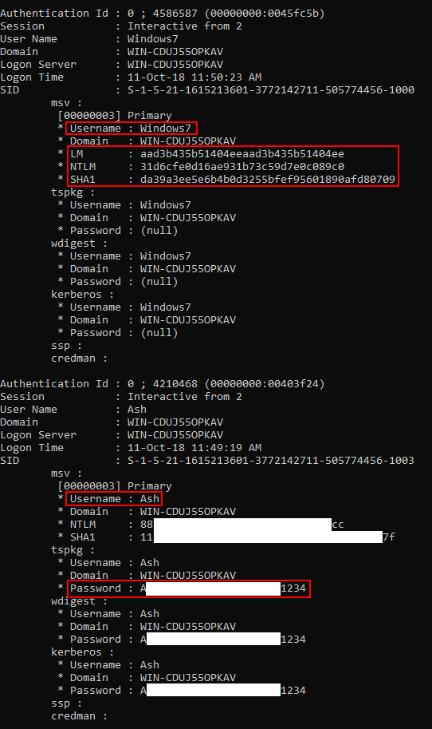
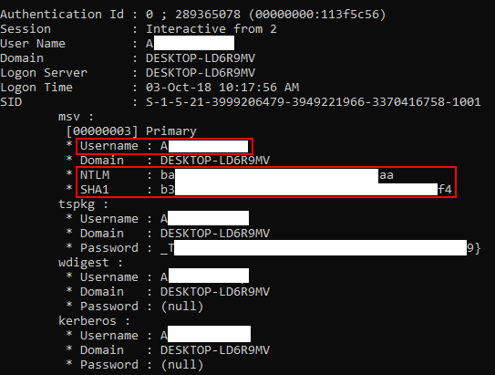

# Password Hash from LSASS Dump

### Download Mimikatz
 - Search `mimikatz` and download. There may be security warnings from antivirus and/or windows defender. These may be ignored.

### Run Dump File Through Mimikatz
 - Launch `Mimikatz`
 - Type: `sekurlsa::Minidump lsass.dmp`
 - Type: `sekurlsa::logonPasswords`

### Notes
 - If you are using anything below Windows 8.1 or Windows Server 2012 R2 the performing a LSASS dump will give you the plaintext password 

### Example
 - Below we have two scenarios. We have two machines, one with updated Windows 7 and one with updated Windows 10.
 - We perform an LSASS dump on both machines.

#### Windows 7 Dump
 - On this machine there are two users. The first is called `Windows7` who is an admin and the other is called `Ash`.
 - Let's have a look at the out after running the dump file through Mimikatz.
 - Notice the passwords are in plaintext.
 - Notice the hash for the `Windows7` user, if we do a lookup of that hash we see that it's the output hash of no data. Which makes sense because there is no password on this user.
 - The `Ash` user as we can see has a very long password, one we wouldn't easily guess and definitely wouldn't be in any hash database. But because they are using Windows 7, we can see it in plaintext. 

	

#### Windows 10 Dump
 - On this machine there is only one user. This user has a very strong password, 18 characters with upper, lower, numbers & special chars.
 - We are able to get the `NTLM` and `SHA1` hashs of the password though.
 - Depending on the situation, this may be able to be used for a Pass the Hash attack.

 	